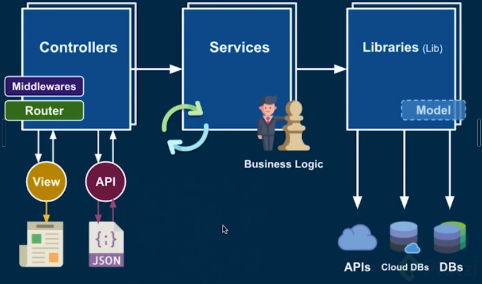

# NestJS

Es un framework sobre abstracciones.
- SOLID
- TS
- POO
- Programacion funcional
- Programacion reactiva

Esta basado en contradores,servicios, modelos y acceso a modelos.

## 3/23 Estructura de aplicaciones en NestJS
Nest utiliza ts por defecto

## 4/23 Presentación del proyecto: Platzi Store

## 5/23 Repaso a TypeScript: tipos y POO

## 6/23 Introducción a controladores
Los controladores se encargan de recibir las request.
- Reciben los request
- Manipulan los request
- Validan permisos
- Validan valores
- Conecta los servicios
Manejo de decoradores, para que nest le diga a una clase de ts como comportarse para el funcionamiento de nest.

#### _Arquitectura de una aplicación_


## 7/23 GET: cómo recibir parámetros

```ts
@Get('products/:productId')
getProduct(@Param('productId') productId:string ): string {
  return `Producto = ${productId}`;
}

@Get('categories/:categoryId/products/:productId')
getCategories(@Param('categoryId') categoryId:string, @Param('productId') productId:string ): string {
  return `Category = ${categoryId} | Producto = ${productId}`;
}
```
